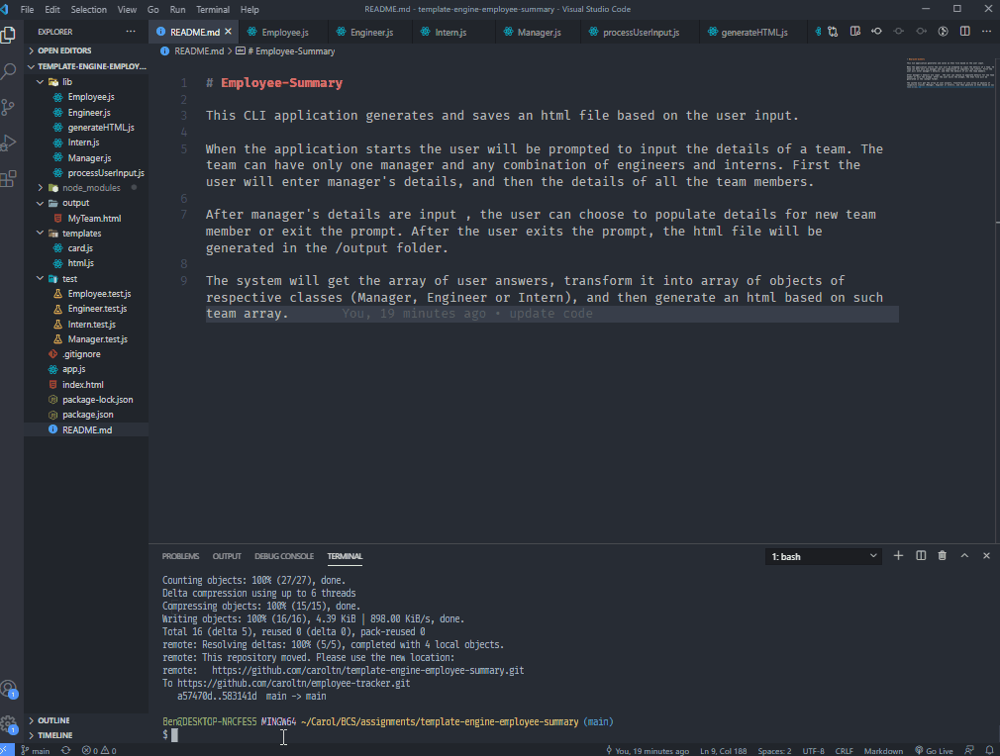

# Employee-Summary

This Node application generates and saves an HTML file based on the user input.

When the application starts the user will be prompted to input the details of a team. The team can have only one manager and any combination of engineers and interns. First the user will enter manager's details, and then the details of all the team members. 

After manager's details are input , the user can choose to populate details for new team member or exit the prompt. After the user exits the prompt, the html file will be generated in the /output folder.

The system will get the array of user answers, transform it into array of objects of respective classes (Manager, Engineer or Intern), and then generate an html based on such team array. 

## Installation
Run `npm install` to install all dependencies

## Usage
---
Run `node apps.js` to start the application

Go to the `output` folder, find `team.html` and open it in your default web browser. This is your output web page for your team. It should look similar to below.

